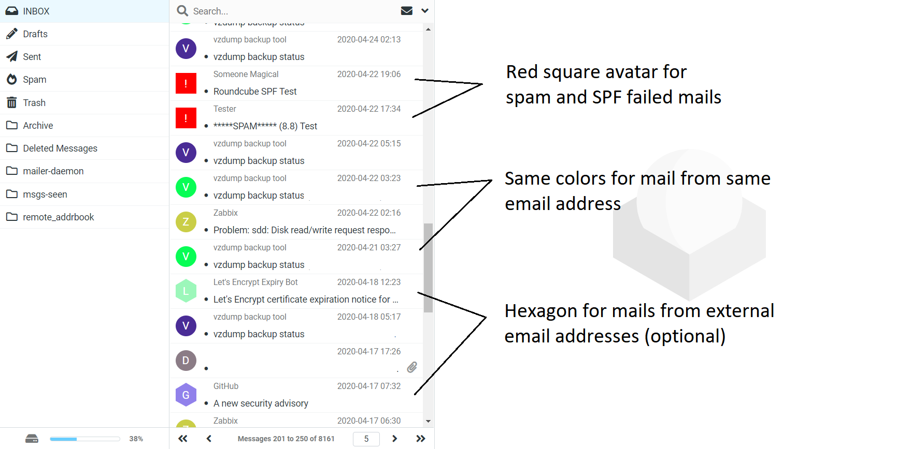
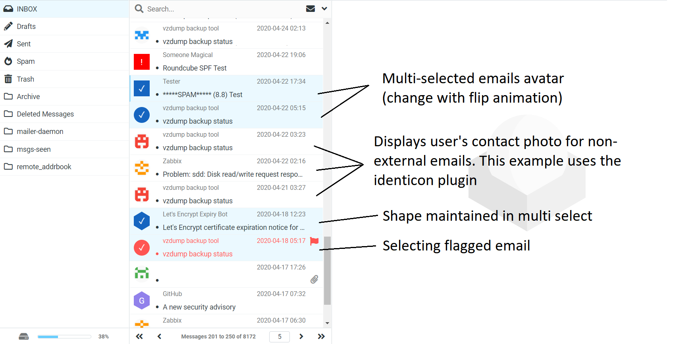
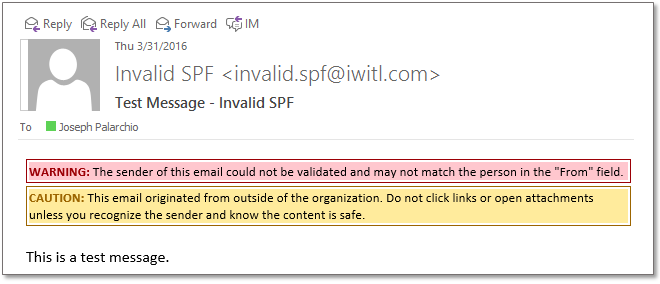
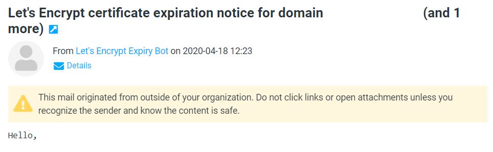
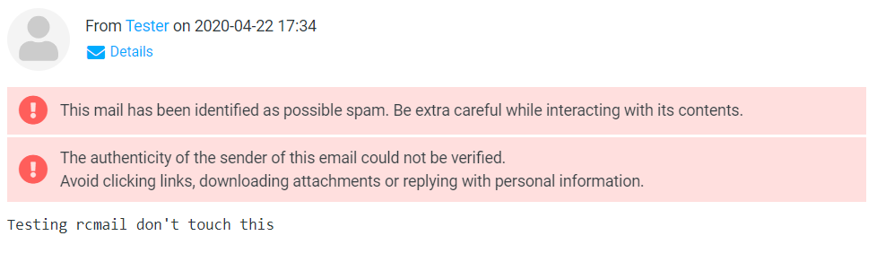
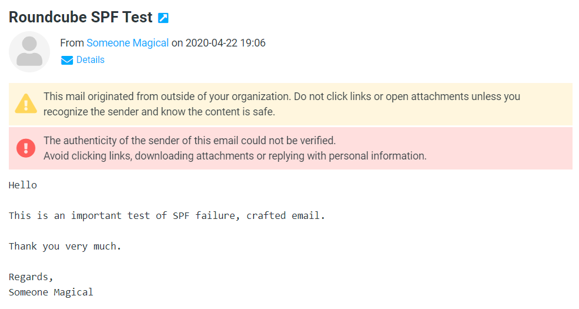

# Roundcube Banner Warn

Displays avatars in roundcube message list and banner warnings under some contexts.

## Screenshots
The plugin adds avatars to the message list that display the user's contact photo or a colored first letter, and warns the user for various contexts. \


On multiselecting emails (which can be done by clicking the avatar), the avatars animate similar to the Gmail app \


### Banner Warnings
Warnings are displayed similar to Outlook \


**With this plugin** \




## Types of warnings
* Email originating from outside your organization
* Marked as spam in X-Spam-Status
* Failing Received-SPF

## Name of this plugin
This plugin is named as such for historical reasons. The chief functionality currently is showing avatars beside the message list, and banner warnings are displayed for individual emails as well.

## Installation
To install, get the plugin with composer in your roundcube directory
```
composer require radialapps/banner-warn
```

## License
Permissively licensed under the MIT license

